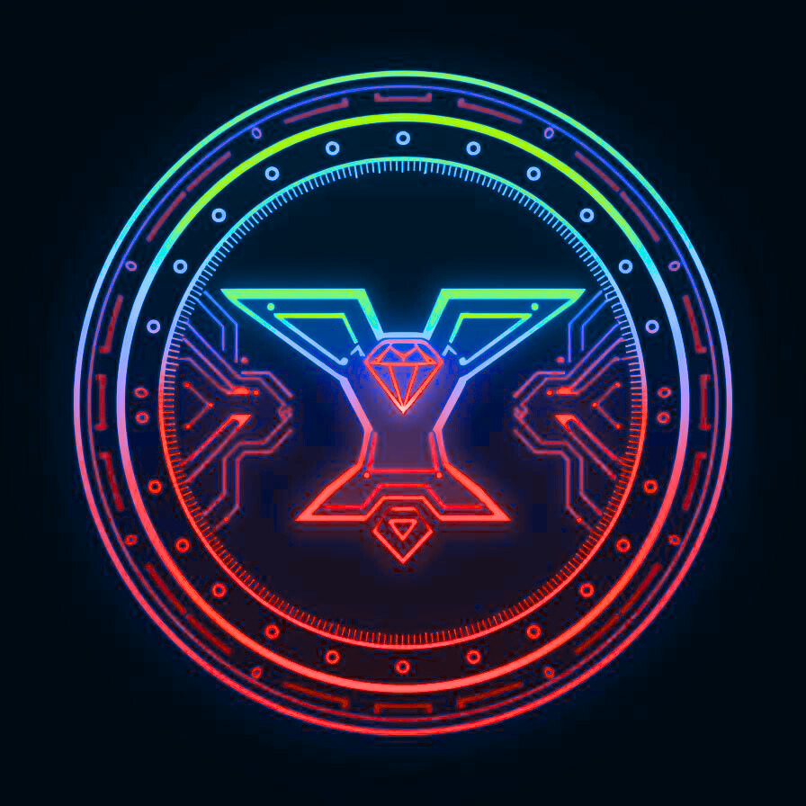

<div align="center">



# YUGA Engine 🎮
## Yielding Unified Game Automation


</div>

**YUGA** is a next-generation game development engine that combines professional-grade tools with AI-powered automation to streamline the entire game creation process. Built for developers of all skill levels, YUGA offers an intuitive interface with powerful features that rival industry-standard engines.

---

## 🌟 Features

### Core Engine Suite

#### 🏠 Dashboard
Your central command center for navigating the entire YUGA ecosystem. Access all tools, monitor project status, and manage your game development workflow from a unified interface.

#### 🎯 Game Engine
Full-featured Unity-style 3D editor with:
- **Scene Hierarchy Management** - Organize game objects in an intuitive tree structure
- **Inspector Panel** - Real-time property editing with transform controls
- **Object Manipulation** - Move, rotate, scale with visual gizmos
- **Multiple Object Types** - Cubes, spheres, cylinders, lights, cameras
- **View Modes** - Perspective, top, front, right views
- **Fullscreen Mode** - Immersive editing experience
- **Real-time 3D Preview** - Powered by Three.js

#### 💻 Script Editor
Professional code editor featuring:
- **Syntax Highlighting** - Full JavaScript/C# language support
- **File Explorer** - Organized project structure navigation
- **Error Detection** - Real-time debugging and validation
- **AI Code Suggestions** - Intelligent code completion
- **Multi-file Tabs** - Work on multiple scripts simultaneously

#### 🎬 Animation Editor
Timeline-based animation system with:
- **Keyframe Timeline** - Visual track-based animation
- **Animation Curves** - Smooth interpolation controls
- **Layer Management** - Organize animations with visibility controls
- **3D Preview** - Real-time animation playback
- **Frame Controls** - Precise frame-by-frame editing

#### 🔗 Visual Scripting
Node-based programming environment:
- **Drag-and-Drop Interface** - Intuitive node creation
- **Multiple Node Types** - Events, actions, logic, math, variables
- **Visual Connections** - Click-to-connect node system
- **Real-time Execution** - See logic flow as you build
- **Node Deletion** - Easy cleanup and reorganization

#### 🤖 AI Code Assistant
AI-powered development companion:
- **Natural Language to Code** - Describe functionality, get code
- **Multi-language Support** - Generate code in various languages
- **Code Explanation** - Understand existing code
- **Code Refactoring** - Improve code quality
- **Documentation Generation** - Auto-generate docs
- **Unit Test Generation** - Create tests automatically

#### 🎨 Asset Generator
AI-driven asset creation tool:
- **3D Model Generation** - Create models from descriptions
- **Texture Synthesis** - Generate materials and textures
- **Multiple Art Styles** - Realistic, cartoon, low-poly, pixel art
- **Quality Settings** - Control output detail
- **Download Assets** - Export generated content

#### 🌍 World Builder (NEW!)
Complete world generation system:
- **AI World Generation** - Create entire worlds from text
- **NPC System** - Generate characters with personalities
- **Quest Generator** - Create quests with objectives
- **Building Placement** - Auto-generate structures
- **Environment Settings** - Lighting, weather, ambience
- **Unity/Godot Export** - JSON format for game engines

#### 🚀 Project Creator
Guided project setup wizard:
- **Template Selection** - Start with pre-configured project types
- **Project Customization** - Tailor settings to your needs
- **AI Generation Options** - Automatically generate starter content

---

## ✨ Features

### 🏠 Dashboard
Central command center for navigating the YUGA ecosystem. Access all tools, monitor project status, and manage your game development workflow.

### 🎯 Game Engine
Full-featured 3D editor with:
- **Scene Hierarchy Management** - Organize game objects in an intuitive tree structure
- **Inspector Panel** - Real-time property editing with transform controls
- **Project Asset Browser** - Visual asset management system
- **Play/Pause/Stop Controls** - Test your game instantly
- **Debug Console** - Track errors, warnings, and logs
- **Real-time Statistics** - Monitor performance metrics (FPS, memory)

### �� Script Editor
Professional code editor featuring:
- **Syntax Highlighting** - Full C# language support
- **File Explorer** - Organized project structure navigation
- **Error Detection** - Real-time debugging and validation
- **AI Code Suggestions** - Intelligent code completion
- **Multi-file Tabs** - Work on multiple scripts simultaneously

### 🎬 Animation Editor
Timeline-based animation system with:
- **Keyframe Timeline** - Visual track-based animation
- **Animation Curves** - Smooth interpolation controls
- **Layer Management** - Organize animations with visibility controls
- **3D Preview** - Real-time animation playback
- **Frame Controls** - Precise frame-by-frame editing

### 🔗 Visual Scripting
Node-based programming environment:
- **Drag-and-Drop Interface** - Intuitive node creation
- **Multiple Node Types** - Events, actions, logic, and math operations
- **Visual Connections** - Clear data flow visualization
- **Real-time Execution** - See logic flow as you build
- **Property Inspector** - Configure nodes with ease

### 🤖 AI Code Assistant
AI-powered development companion:
- **Natural Language to Code** - Describe functionality, get code
- **Multi-language Support** - Generate code in various languages
- **Template Library** - Pre-built solutions for common tasks
- **Context-aware Suggestions** - Smart recommendations based on your project

### 🎨 Asset Generator
AI-driven asset creation tool:
- **3D Model Generation** - Create models from descriptions
- **Texture Synthesis** - Generate materials and textures
- **Character Design** - Build characters with AI assistance
- **Multiple Art Styles** - Choose from various aesthetic options
- **Quality Settings** - Control output detail and complexity

### 🚀 Project Creator
Guided project setup wizard:
- **Template Selection** - Start with pre-configured project types
- **Project Customization** - Tailor settings to your needs
- **AI Generation Options** - Automatically generate starter content

---

## 🏗️ Architecture

### Core Systems

**Node System** (Godot-inspired)
- Hierarchical scene tree
- Parent-child relationships
- Component-based architecture
- Property system

**Scene Management**
- Dynamic node creation/deletion
- Scene serialization
- Event-driven updates
- Hierarchy traversal

**Component System**
- TransformComponent - Position, rotation, scale
- RendererComponent - 3D mesh rendering
- ScriptComponent - Custom behavior
- PhysicsComponent - Rigid body physics
- AnimatorComponent - Keyframe animations

---

## 🚀 Getting Started

### Installation

1. **Clone or download the repository**
```bash
cd c:\Users\Pratham arun\source\repos\YUGA
```

2. **Install dependencies**
```bash
npm install
```

3. **Run in development mode**
```bash
npm run dev
```

The app will launch automatically with the web server running on `http://localhost:3000`.

### Building Standalone App

**Windows:**
```bash
npm run build-win
```

**macOS:**
```bash
npm run build-mac
```

**Linux:**
```bash
npm run build-linux
```

Installers will be created in the `dist/` folder.

---

## 📊 Technology Stack

- **Frontend Framework**: Vanilla JavaScript (ES6+)
- **Styling**: Tailwind CSS
- **3D Rendering**: Three.js r128
- **Desktop Framework**: Electron
- **State Management**: React-like hooks pattern
- **Routing**: Client-side hash routing
- **Build Tool**: Electron Builder

---

## 🎯 Workflow

1. **Create Project** → Choose template and customize settings
2. **Design Scenes** → Use the main engine editor to build levels
3. **Write Scripts** → Code editor or visual scripting for logic
4. **Create Animations** → Timeline-based animation tools
5. **Generate Assets** → AI-powered asset creation
6. **Test & Debug** → Live preview and debugging tools
7. **Optimize** → Performance profiling and optimization
8. **Export** → Build for multiple platforms

---

## 💪 Why YUGA?

### Solves Industry Pain Points

**Complex Workflow** → Prompt-to-Prototype System
- Build playable worlds from text commands
- Auto-generates scenes, scripts, and logic

**Time-Consuming Assets** → AI Blacksmith
- Auto-generates 3D models, textures, animations
- Saves time, lowers cost, enables endless variations

**Code Complexity** → AI Code Generator
- Writes scripts from natural language
- Explains logic, fixes bugs, optimizes performance

**Limited Collaboration** → Collaborative AI Co-Builder
- Multiple users forge worlds together
- AI merges inputs seamlessly

**Procedural Generation** → AI Procedural Generator
- Creates environments with biome control
- Refines level balance and player paths

**Steep Learning Curve** → AI Tutor Mode
- Explains each script and setting
- Voice-based learning built into editor

**Manual Playtesting** → AI Playtester Mode
- Simulates players to test difficulty
- Gives reports on balance and bugs

**Creativity Fatigue** → Generative Brainstorm Mode
- AI suggests ideas for weapons, maps, lore
- Keeps creativity alive through co-creation

**Integration Overload** → Unified AI Creation Hub
- Asset creation, code generation, testing in one place
- No switching between apps

---

## 📁 Project Structure

```
YUGA/
├── electron/
│   ├── main.js              # Electron main process
│   └── preload.js           # Secure IPC bridge
├── src/
│   ├── core/
│   │   ├���─ Node.js          # Node system (Godot-inspired)
│   │   ├── Scene.js         # Scene management
│   │   └── Component.js     # Component system
│   ├── views/
│   │   ├── Dashboard.js
│   │   ├── Engine.js
│   │   ├── ScriptEditor.js
│   │   ├── AnimationEditor.js
│   │   ├── VisualScripting.js
│   │   ├── AIAssistant.js
│   │   ├── AssetGenerator.js
│   │   └── NewProject.js
│   ├── ui/
│   │   └── Layout.js
│   ├── main.js              # App entry point
│   ├── router.js            # Client-side routing
│   └── state-enhanced.js    # State management
├── assets/                  # Icons and resources
├── index.html               # Main HTML
├── package.json             # Dependencies
├── SETUP.md                 # Setup guide
└── README.md               # This file
```

---

## 🔧 Development

### Hot Reload
Changes automatically reload during development.

### DevTools
Press `F12` to open Chrome DevTools.

### File Operations
- Save projects as `.yuga` files
- Load projects from disk
- Export to WebGL, Windows, macOS, Linux

---

## 📦 Distribution

### Windows
- Installer: `YUGA Engine Setup 1.0.0.exe`
- Portable: `YUGA Engine 1.0.0.exe`

### macOS
- DMG: `YUGA Engine-1.0.0.dmg`
- ZIP: `YUGA Engine-1.0.0.zip`

### Linux
- AppImage: `YUGA Engine-1.0.0.AppImage`
- Debian: `yuga-engine_1.0.0_amd64.deb`

---

## 🎓 Learning Resources

- **Documentation** - In-app help system
- **Example Projects** - Pre-built templates
- **Video Tutorials** - Step-by-step guides
- **API Reference** - Complete documentation

---

## 🤝 Contributing

We welcome contributions! Areas we need help with:

- Physics engine integration
- Export/build system development
- Multiplayer networking
- Advanced rendering features
- Mobile optimization

---

## 📜 License

YUGA Engine is released under the **MIT License**.

```
MIT License

Copyright (c) 2025 YUGA Engine Team

Permission is hereby granted, free of charge, to any person obtaining a copy
of this software and associated documentation files (the "Software"), to deal
in the Software without restriction, including without limitation the rights
to use, copy, modify, merge, publish, distribute, sublicense, and/or sell
copies of the Software, and to permit persons to whom the Software is
furnished to do so, subject to the following conditions:

The above copyright notice and this permission notice shall be included in all
copies or substantial portions of the Software.

THE SOFTWARE IS PROVIDED "AS IS", WITHOUT WARRANTY OF ANY KIND, EXPRESS OR
IMPLIED, INCLUDING BUT NOT LIMITED TO THE WARRANTIES OF MERCHANTABILITY,
FITNESS FOR A PARTICULAR PURPOSE AND NONINFRINGEMENT.
```

---

## 🙏 Acknowledgments & Attribution

YUGA Engine incorporates code, design patterns, and concepts from the following open-source projects:

### Godot Engine
- **License**: MIT License
- **Copyright**: (c) 2014-present Godot Engine contributors, (c) 2007-2014 Juan Linietsky, Ariel Manzur
- **Website**: https://godotengine.org
- **Used in**: Scene system architecture, node-based hierarchy, inspector panels, transform controls
- **Full License**: See [GODOT_LICENSE.txt](GODOT_LICENSE.txt)

### Three.js
- **License**: MIT License
- **Website**: https://threejs.org
- **Used in**: 3D rendering, camera controls, geometry systems

### React
- **License**: MIT License
- **Copyright**: (c) Meta Platforms, Inc.
- **Used in**: UI framework and component system

### Electron
- **License**: MIT License
- **Used in**: Desktop application framework

### Tailwind CSS
- **License**: MIT License
- **Used in**: Styling and design system

### Lucide Icons
- **License**: ISC License
- **Website**: https://lucide.dev
- **Used in**: UI icons

For complete attribution details, see [ATTRIBUTION.txt](ATTRIBUTION.txt).

---

## 🚀 Roadmap

### Version 1.1 (Q1 2026)
- Physics engine integration
- Advanced rendering pipeline
- Audio system implementation
- Export system for WebGL

### Version 1.2 (Q2 2026)
- Multiplayer networking
- Real-time collaboration
- Cloud save and version control
- Mobile touch controls

### Version 1.3 (Q3 2026)
- Advanced animation system (IK, blend trees)
- Particle system
- Shader graph editor
- Profiler and debugging tools

### Version 2.0 (Q4 2026)
- Asset marketplace
- Native platform exports
- VR/AR support
- Analytics integration

---

## 📞 Support

For issues, questions, or suggestions:
1. Check the documentation
2. Review example projects
3. Open an issue on GitHub

---

**Happy Game Development! 🎮✨**

*YUGA Engine - Yielding Unified Game Automation*
